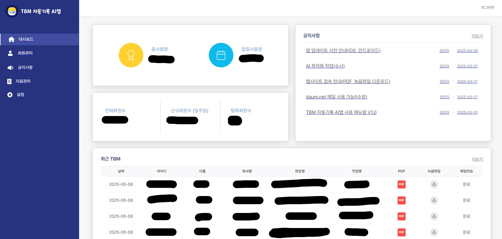

# 🛡️ SafePeople TBM AI 솔루션 – Admin Dashboard Case Study

> **Period** | 2025.01.06 – 2025.01.17 
> **Role**  | Front‑End (Admin 전담)  
> **Stack** | React • TypeScript • React‑Router • Zustand • Axios • Styled‑Components • moment • react-quill

  
  
<em>로그인 화면 – JWT 기반 인증</em>

  
  
<em>데시보드</em>

---

## 📌 서비스 개요
현장 TBM(Tool Box Meeting) 점검 내용을 **모바일 앱**에서 음성 녹음   
→ **AI STT & NLP**가 자동 텍스트화  
→ PDF 보고서가 즉시 생성·배포되는 **안전관리 통합 플랫폼**입니다.

Admin 웹은  
1. **회원·권한 관리**  
2. **TBM 통계 대시보드**  
3. **공지사항·자료 관리**  
4. **AI 모델 성능 리포트 뷰어**  
를 담당합니다.

---

## 🔑 Key Contributions (내가 한 일)

1. **디자인 패턴 수립 (MVVM + Atomic Design)**  
  - View ↔ ViewModel ↔ Domain 계층 분리 가이드 작성  
  - 커스텀 hook 패턴
  - Compound Components 패턴

2. **전체 페이지 구현**  
  - 로그인, 대시보드, 멤버·권한, 공지사항, 파일 관리 등 **6 라우트·18 화면** 개발  
  - React‑Router v6 동적 라우팅 및 코드 스플리팅 적용  

3. **카드·테이블 컴포넌트 아토믹화** (**재사용률 +30 %**)  
  - KPI Card, Stats Card, Recent TBM Table을 **프로퍼티 기반**으로 설계  
  - 공통 로직은 **Custom Hook 패턴**으로 추출, 해당 훅을 상위 컴포넌트 내부에서 호출  
  - 공통 UI 컴포넌트는 동일 폴더(components/*) 안에 배치해 의존성 최소화  

4. **API Error Boundary & Auth Interceptor**  
  - **커스텀 포트(사내 정의 응답 코드)** 감지 시 Refresh‑Token 재발급 · 전역 토스트 알림  
  - 호출 흐름: **Page → Custom Hook → apiService(타입별 함수) → apiClient**  
  - apiService에서 누락 프로퍼티나 null 값은 **타입별 기본값**으로 보정 후 ViewModel에 역순 매핑  
  - 요청 실패 시 Fallback UI 렌더 → **서비스 중단 Zero**

---

## 🏗️ Information Architecture
- 참고 → [`03_template`](../03_template)