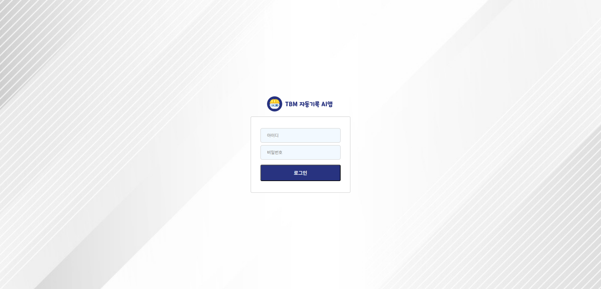

# 🛡️ SafePeople TBM AI 솔루션 – Admin Dashboard Case Study

> **Period** | 2025.01.06 – 2025.01.17 
> **Role**  | Front‑End (Admin 전담)  
> **Stack** | React • TypeScript • React‑Router • Zustand • Axios • Styled‑Components • moment • react-quill

  
  
<em>로그인 화면 – JWT 기반 인증</em>

  
  
<em>데시보드</em>

---

## 📌 서비스 개요
현장 TBM(Tool Box Meeting) 점검 내용을 **모바일 앱**에서 음성 녹음 →  
⏩ **AI STT & NLP**가 자동 텍스트화 →  
⏩ PDF 보고서가 즉시 생성·배포되는 **안전관리 통합 플랫폼**입니다.

Admin 웹은  
1. **회원·권한 관리**  
2. **TBM 통계 대시보드**  
3. **공지사항·자료 관리**  
4. **AI 모델 성능 리포트 뷰어**  
를 담당합니다.

---

## 💡 Problem & Goal
| 기존 Pain‑Point | 목표 |
|-----------------|------|
| 현장 기록이 수기로 남아 **데이터 누락·지연** | 실시간 AI 기록 → PDF 자동 배포 |
| 관리자 UI 흐름이 복잡해 **데이터 조회 비용↑** | 단일 대시보드에서 **KPI·최근 TBM** 한눈에 |
| 로그인 세션 만료 이슈(401 Error) | **JWT Refresh Token** & Interceptor 고도화 |

---

## 🏗️ Information Architecture
- 참고 → [`03_template`](../03_template)