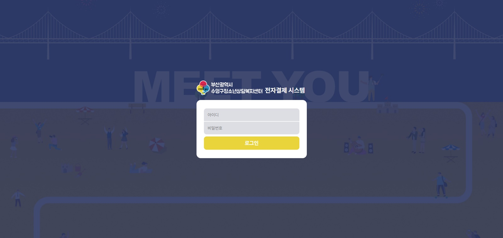
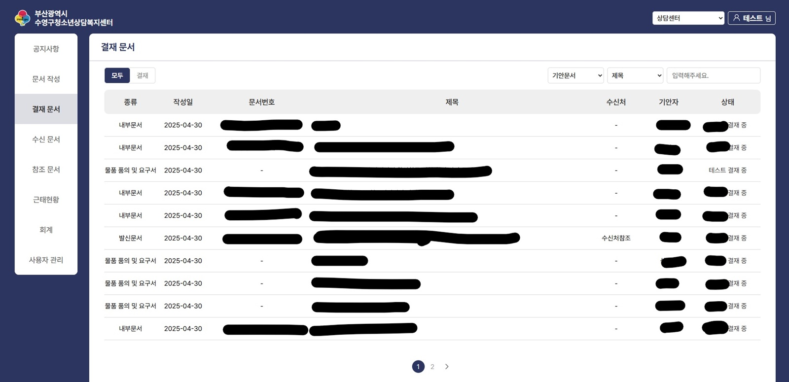
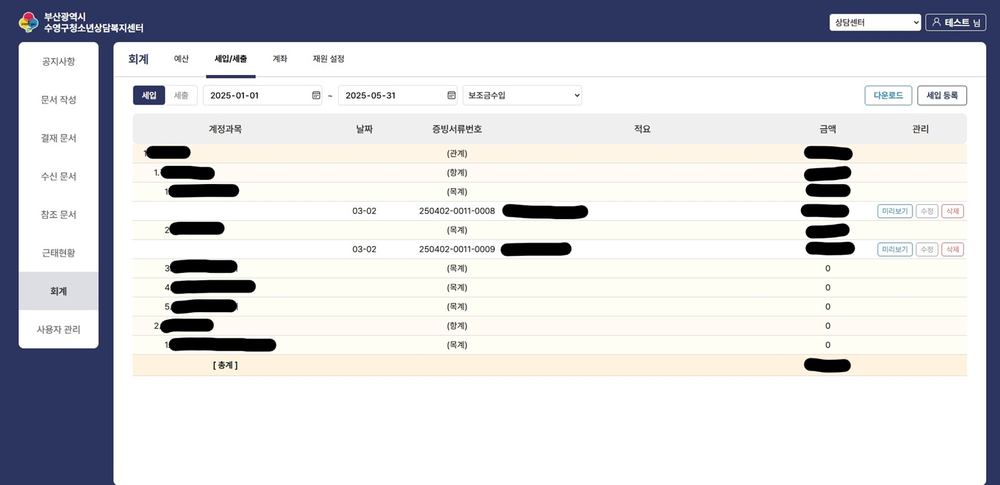
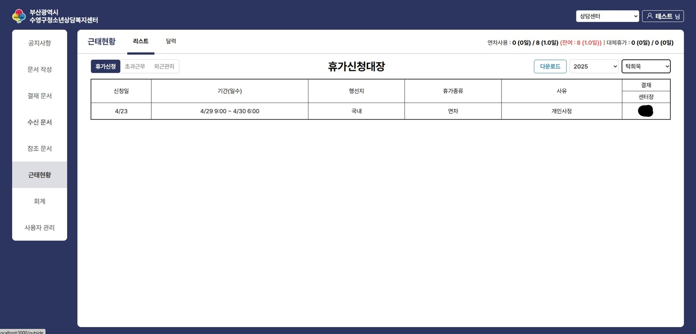

# 🏫 Suyeong e‑Approval 시스템 – Admin

> **Period** | 2025.02.01 → 2025.04.30  
> **Role**  | Front‑End Solo (기획 제외 전 페이지 개발)  
> **Stack** | React • TypeScript • React‑Router • Zustand • Axios • Styled‑Components • moment • react‑quill

  
  
<em>로그인 – JWT 기반 인증</em>

  
  
<em>결재 문서 목록</em>

  
  
<em>회계 – 세입·세출 현황</em>

  
  
<em>근태 현황 – 휴가 신청 대장</em>

---

## 📌 서비스 개요
청소년상담복지센터 내부 업무 프로세스(결재·근태·회계)를 **전자화·자동화**한 웹 관리 시스템입니다.

Admin 웹 주요 모듈  
1. **전자 결재** : 기안·결재·수신·참조 문서 흐름 관리  
2. **근태 관리** : 휴가·초과근무·외근 신청 & 캘린더 뷰  
3. **회계 관리** : 세입·세출·예산·계좌 조회 & 엑셀 다운로드  
4. **공지사항 / 사용자 관리** : 권한별 메뉴 노출 및 WYSIWYG 편집

---

## 🔑 Key Contributions (내가 한 일)
1. **디자인 패턴 수립 (MVVM + Atomic Design)**  
   - View ↔ ViewModel ↔ Domain 계층 분리 가이드 작성  
   - **Custom Hook** · **Compound Components** 패턴 적용

2. **전체 페이지 구현**  
   - 로그인, 결재, 근태, 회계, 공지, 사용자 등 **7 라우트 · 20 + 화면** 개발  
   - React‑Router v6 동적 라우팅 & 코드 스플리팅

3. **카드·테이블 컴포넌트 아토믹화** (**재사용률 +30 %**)  
   - 결재 상태 Badge, 회계 테이블, KPI Card 등을 프로퍼티 기반으로 설계  
   - 공통 로직은 Custom Hook으로 추출 → 상위 컴포넌트 내부 호출

4. **API Error Boundary & Auth Interceptor**  
   - **커스텀 포트(사내 정의 응답 코드)** 감지 시 Refresh‑Token 재발급 & 전역 토스트 알림  
   - 호출 흐름: **Page → Custom Hook → apiService → apiClient**  
   - apiService에서 null/누락 값은 **타입별 기본값** 보정 후 ViewModel에 역순 매핑  
   - 실패 시 Fallback UI 렌더 → 서비스 중단 Zero

---

## 🏗️ Information Architecture
- 참고 → [`03_template`](../03_template)